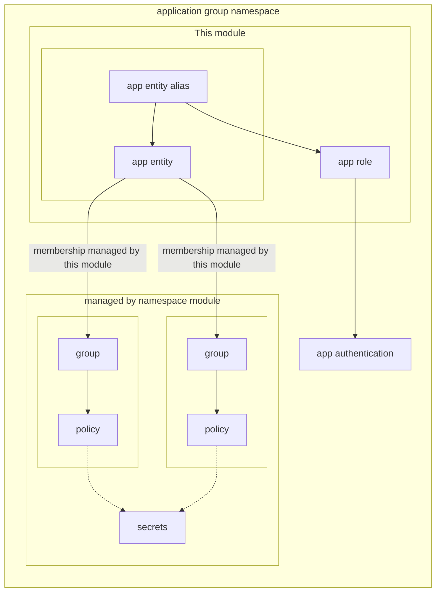

# terraform-vault-app

<!-- BEGIN_TF_DOCS -->
## Requirements

| Name | Version |
|------|---------|
|  [terraform](#requirement\_terraform) | >= 1.0.0, < 2.0.0 |
|  [vault](#requirement\_vault) | >= 3.7.0, < 4.0.0 |

## Providers

No providers.

## Modules

| Name | Source | Version |
|------|--------|---------|
|  [application](#module\_application) | ../../modules/terraform-vault-application | n/a |

## Resources

No resources.

## Inputs

| Name | Description | Type | Default | Required |
|------|-------------|------|---------|:--------:|
|  [app](#input\_app) | Application name | `string` | n/a | yes |
|  [app\_group\_membership](#input\_app\_group\_membership) | Application groups this application is a member of | `set(string)` | `[]` | no |
|  [auth\_type](#input\_auth\_type) | App authentication type | `string` | n/a | yes |
|  [create\_app\_kv\_secret](#input\_create\_app\_kv\_secret) | Create app KV secret | `bool` | `false` | no |
|  [create\_app\_transit\_secret](#input\_create\_app\_transit\_secret) | Create app transit key | `bool` | `false` | no |
|  [grp](#input\_grp) | Application group name | `string` | n/a | yes |
|  [parent\_namespace](#input\_parent\_namespace) | The namespace will be created under this namespace | `string` | `""` | no |
|  [prefix](#input\_prefix) | Application prefix. Normally used for the environment name (e.g., prod, qa, uat, dev, etc.) | `string` | n/a | yes |
|  [shared\_group\_membership](#input\_shared\_group\_membership) | Application groups this application is a member of | `set(string)` | `[]` | no |
|  [shared\_group\_namespace](#input\_shared\_group\_namespace) | Namespace for the  groups, if different from the application auth namespace | `string` | `null` | no |
|  [tls\_role\_ca\_cert](#input\_tls\_role\_ca\_cert) | CA certificate for TLS roles | `string` | `""` | no |

## Outputs

No outputs.
<!-- END_TF_DOCS -->